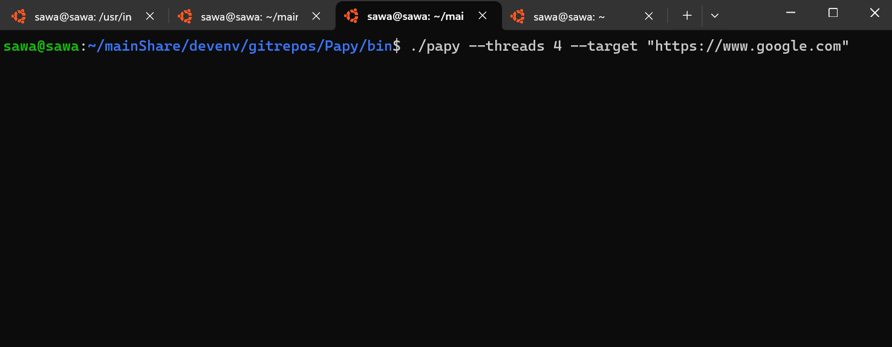
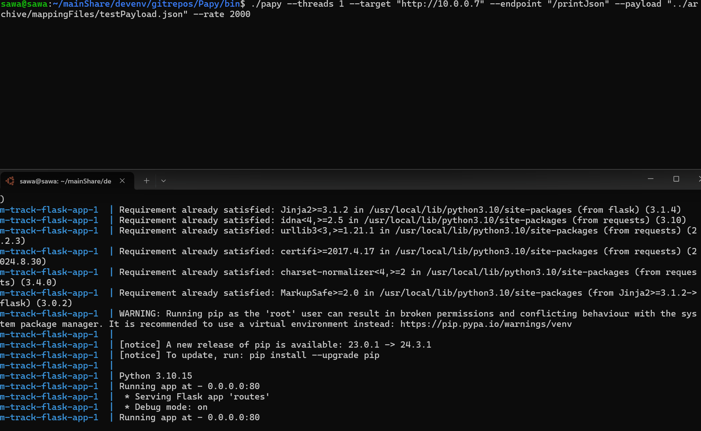
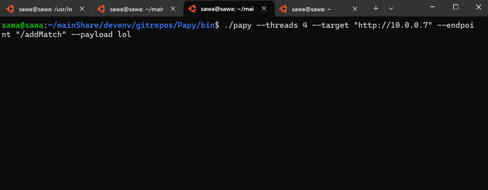
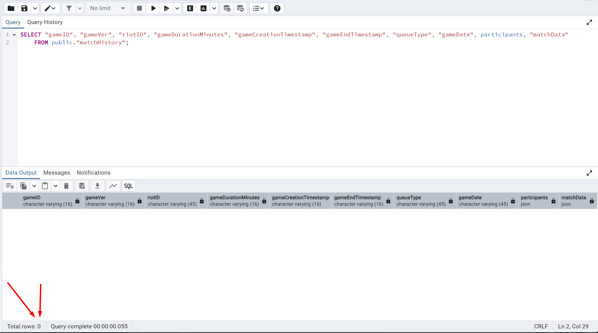
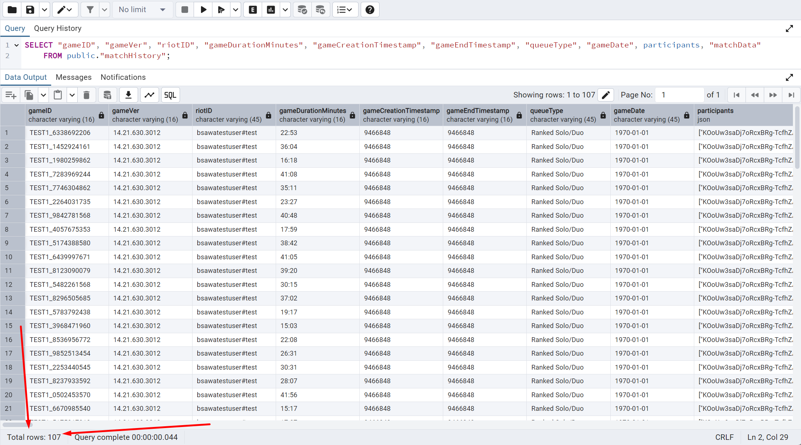

# Software User Guide

## Table of Contents
1. [Introduction](#introduction)
2. [Getting Started](#getting-started)
3. [User Interface Guide](#user-interface-guide)
4. [Features and Functionality](#features-and-functionality)
5. [FAQs and Troubleshooting](#faqs-and-troubleshooting)
6. [Best Practices](#best-practices)
7. [Glossary](#glossary)

---

## Introduction

Papy is an open-source command line tool API load testing tool that is meant to be light weight, fast, and flexible.

### Key Features
Some of the key features include:
- Customized targetting (server address and endpoint)
- Customizable payloads
- Pseudo randomized payloads
- Verbose or compact response reporting
- HTTP and HTTPS traffic capabilities
- Traffic controls
  - Spike traffic
  - Ramp traffic
  - Rate limited traffic


### Target Audience
If you are a user familiar with a CLI then you can use this tool! It was intentionally developed to be: 
- Simple to use
- Easy to integrate with other tooling
- Light weight

---

## Getting Started

### Installation
The following is a step-by-step set of instructions for installing or accessing Papy.

First things first is to clone the repo:
```bash
git clone https://github.com/noahpop77/Papy.git
```

Then you need to navigate to the cloned Papy directory:
```bash
cd Papy
```

You will need functional build system. In the case of Papy I used makefile to build the project. You can determine if you have make installed by using:
```bash
make --version
```


The command to build Papy is the following once you are in the project root directory. 
```bash
make build
```


### Initial Setup
Now we got Papy up built and ready for you! Lets get our hands on it now. After the build the Papy Binary/executable will be in the `bin` directory.

Navigate to the `Papy/bin` directory:
```bash
cd bin
```

Papy will be in the `bin` directory. Run the Papy help command to get a sense of what flags you can make use of and to verify that papy was built successfully.
```bash
./papy --help
```


### First Steps
Lets launch some requests! The following are examples of possible use cases and the commands that would go along with them. Papy is highly configurable though so there are many more possible configurations depending on what you are trying to achieve.

If you want to launch a bunch of GET requests to a specific site:
```bash
./papy --threads 4 --target "https://www.google.com"
```


If you want to send a static payload from a JSON file then simply specify the file path to your JSON file. The following command looks to the directory structure `../archive/mappingFiles/testPayload.json` for example to send `testPayload.json` as the body of the POST requests. This command also displays the functionality of the `--rate` flag which rate limits the requests by adding a delay of X milliseconds between each request.
```bash
./papy --threads 1 --target "http://10.0.0.7" --endpoint "/printJson" --payload "../archive/mappingFiles/testPayload.json" --rate 2000
```
The contents of `testPayload.json` are as follows:
```json
{
    "overrides": {
        "business_unit" : {
            "name" : "BOB"
        },
        "application" : {
            "name" : "BOB"
        },
        "project" : {
            "name" : "BOB"
        }
    }
}

```

> **Note:** The bottom terminal is a locally deployed web application that prints the body of its received POST requests for demonstration purposes.

The following is an example of me testing the database of a locally deployed web application I created called [M-Track](https://github.com/noahpop77/M-Track). This execution run will use the randomized payload generation for League of Legends. The lol payload will trigger a class in the tool to generate a randomized League of Legends match file and send that to the API endpoint of [M-Track](https://github.com/noahpop77/M-Track).
```bash
./papy --threads 4 --target "http://10.0.0.7" --endpoint "/addMatch" --payload lol
```


#### M-Track PostgreSQL Databse Before Papy


#### M-Track PostgreSQL Databse After Papy

---

## User Interface Guide
- **UI Elements**: Description of key components in the user interface.
- **Navigation**: Tips for moving through the application efficiently.
- **Common Workflows**: Examples of typical tasks performed in the software.

---

## Features and Functionality
- **Core Features**: Explain primary capabilities with examples.
- **How-To Guides**:
  - Task 1: [Guide for Task 1]
  - Task 2: [Guide for Task 2]
- Include screenshots or diagrams where applicable.

---

## FAQs and Troubleshooting
- **Frequently Asked Questions**:
  - *Question 1*: Answer.
  - *Question 2*: Answer.
- **Troubleshooting**:
  - Problem: Steps to resolve.
- **Support**: Contact information for further assistance.

---

## Best Practices
- Tips for using the software effectively.
- Recommended workflows or configurations.

---

## Glossary
- **Term 1**: Definition.
- **Term 2**: Definition.
